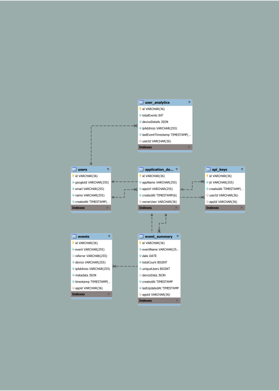

## Introduction
Thank you for this opportunity.

Please refer to the Swagger API Docs on /api-docs endpoint for the API Endpoints. Its payload and responses.

Please follow the below steps to clone this repo and get it running :
1. Install nodejs.
2. Clone the repo.
3. run ```npm i```
4. Create a .env file and insert the attributes shared to you over mail.
5. run ```node index.js```

## Description 
Tech Stack Used : NodeJs , ExpressJs , MySQL , Redis, BullMQ.

## ER Diagram



I have tried to keep the tables is relational as possible.

## Call Flow Diagram 


* As the call flow suggests, the collect API call directly pushes the logs to a redis list. It is then read from the redis list, processed and pushed into three tables -> events , event_summary , user_analytics . These three tables are sufficient for our analytics end points.
* The timeout scenario explained: my bullmq job is only fired for redis length more than a certain threshold lets say 500. But what if the redis list is only filled to 499 and goes quiet . This will lead to starvation until one more log is pushed . To tackle this scenario I have added a timeout of 60 seconds. If the list is lower than threshold and 60 seconds have passed, then I will trigger a job for any number of items present in the redis list,
* The only con of this is the analytics might be delayed by 30 seconds at max(the timeout scenario).

## Misc Features:

* Added middleware to protect our routes. There are two types of token. The first one is generated post successfull login via Google. The second one is generated post successull API Call for ```/auth/api-key``` endpoint.
* This was done purely with authentication and edge cases in mind. This also helped me with the revoking logic.
* Both tokens are essentially JWTs.
* While I have used Redis wherever possible, I have a strong belief of using Redis as a caching layer and not as a promary source of data.Therefore, all the data is priamrily stored in SQL.
* I have made use of BullMQ for handling the logging part. I could have used RabbitMq / Kafka but here are my reasons for using BullMQ on top of redis.
    * RabbitMq could have added another layer of complexity.
    * BullMQ supported pretty much all of the features I wanted from a Pub/Sub Model.
    * I observed very fast repsonse times for the /collect endpoint. This was very crucial as that endpoint shall be hit the most amount of times from a lot of clients. Response times were below 15ms. Since I dont want premanent storage of messages in redis, processing and discarding wont fill up redis.
    * The whole point of introducing BullMQ is to reduce the load on DB as much as possible. Therefore, I am  initiating the processing of logs only after a certain threshold is hit OR a timeout occurs.
* Added validation Schema for all the endpoints where I am expecting input from the user.
* I have created helper functions wherever I deemed fit. As always there is still some scope of improving it further.
* I have written test cases for a couple of helper functions. However the whole codebase is not covered with testcases due to shortage of time. Nevertheless , I have tried testing it with edge cases as much as possible. Most of the edge cases arise due to faulty input from the user and my validation schema is taking care of it in the most strictest way.
* There are three types of middlwares : 
    * Validating the user token.
    * Validating the analytics token.
    * Validating the payload sent by user.
* I have developed the pub/sub model in conjunction with redis list. This has made the ```collect``` endpoint as lightweight and ultra low response time as possible.The call flow shall describe it further.


## Future Improvements::

* Given more time, I will definitely write more test scripts . I am more interested in learning integration testing than unit test cases as I strongly believe mimicking the real flow as close as possible will minimise bugs.
* Paritioning tables as per lets say date/month is a possibility given the amount of data and rate at which it comes.
* Caching is a dual edged sword. On one hand , in an ideal world , everyone would like to cache everything. But given the limited resources, we should aim to cache only the endpoints/ datapoints which are in need of cache. Right now , my approach is good enough to use the DB itself , but in the future we can add a cache layer for that as well.